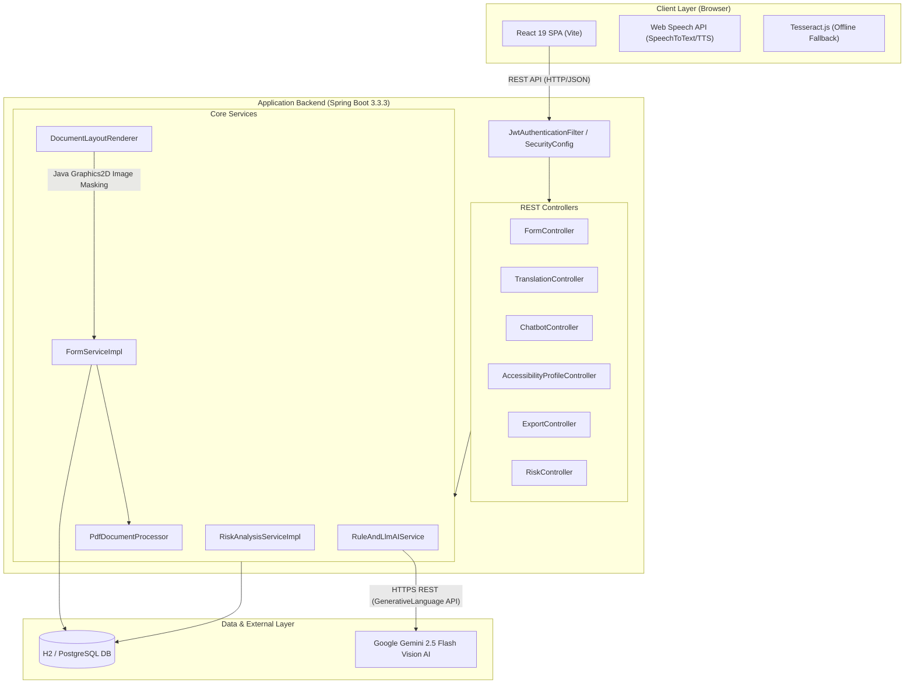

# System Architecture Document

This document describes the actual technical architecture of **Fill-For-Me (FormForAll)** based on the current codebase implementation.

---

## 1. System Overview

Fill-For-Me is built using a decoupled client-server architecture:
- **Frontend SPA**: A single-page application built with React 19 and Vite 8 providing responsive, accessible web interfaces.
- **Backend REST API**: A Spring Boot 3.3.3 application handling authentication, form ingestion, PDF processing, AI Vision integrations, layout rendering, and security analysis.
- **Data Store**: Relational database (H2 for development, PostgreSQL for production) managed via Spring Data JPA and Hibernate.
- **AI Vision Engine**: External multimodal integration with Google Gemini 2.5/2.0 Flash Vision AI for layout preservation, translation, and document field extraction.

---

## 2. System Architecture Diagram



---

## 3. Frontend Architecture

- **Framework & Build**: React 19 bundled with Vite 8.
- **Routing**: React Router DOM (`/`, `/dashboard`, `/translate`, `/chat`, `/profile`, `/forms/:sessionId`).
- **Styling**: Modular Vanilla CSS design tokens with custom HSL palette, dark mode glassmorphic UI, and accessibility scaling variables.
- **API Client**: Axios instance configured in `frontend/src/api/apiClient.js` with 120s timeout and dynamic `VITE_API_BASE_URL` fallback.
- **Key Modules**:
  - `components/ocr/SnapToFormModal.jsx`: Document photo upload, camera capture, Vision AI auto-fill trigger, and field mapping review.
  - `pages/FormTranslationPage.jsx`: Google Lens-style document translator preview with side-by-side original vs translated canvas overlays.
  - `components/chatbot/ChatbotWidget.jsx`: Contextual floating AI assistant widget available across all routes.
  - `context/AuthContext.jsx` & `context/AccessibilityContext.jsx`: Global state providers for authentication and dynamic accessibility profile application.

---

## 4. Backend Architecture

- **Framework**: Spring Boot 3.3.3 running on Java 21 / 24.
- **Security & Auth**: Stateless JWT authentication implemented via `JwtAuthenticationFilter` and `SecurityConfig`. Public endpoints (`/api/auth/**`, `/api/forms/**`, `/api/translation/**`, `/api/export/**`) are explicitly configured.
- **Core Packages**:
  - `com.fillforme.backend.auth`: User registration, JWT token generation, and principal resolution.
  - `com.fillforme.backend.form`: Form ingestion (file & URL), custom field processing, session management, and field response tracking.
  - `com.fillforme.backend.ai`: Gemini Vision AI prompt construction, line-by-line bounding box translation, and structured field JSON parsing.
  - `com.fillforme.backend.translation`: `DocumentLayoutRenderer` utilizing Java `Graphics2D` to erase original text coordinates and overlay translated text in target regional languages.
  - `com.fillforme.backend.document`: PDF text & field parsing via Apache PDFBox, file storage controller streaming.
  - `com.fillforme.backend.profile`: User accessibility preference persistence.
  - `com.fillforme.backend.risk`: Privacy score assessment and sensitive field risk categorization.
  - `com.fillforme.backend.export`: Filled form PDF export rendering and submission handlers.

---

## 5. Data Layer

- **Database Engine**: H2 In-Memory DB (`jdbc:h2:mem:fillformedb`) for rapid local development; PostgreSQL schema compatible.
- **ORM & Data Access**: Spring Data JPA with Hibernate ORM.
- **Primary JPA Entities**:
  - `User`: Accounts and authentication credentials.
  - `AccessibilityProfile`: User UI preferences (font scale, contrast, voice speed, dyslexia font).
  - `FormSession`: Tracks active form filling sessions, progress percentages, and status.
  - `FormField`: Individual form input definitions, field keys, labels, types, and help text.
  - `FieldResponse`: User-submitted or AI auto-filled field values with confidence scores.
  - `RiskFlag`: Security warnings associated with specific form fields.

---

## 6. External Services Integration

| Service | Purpose | Integration Point | Credentials Required |
| :--- | :--- | :--- | :--- |
| **Google Gemini 2.5 Flash Vision AI** | Multimodal document layout translation, line coordinate detection, and document auto-fill value extraction. | `RuleAndLlmAIService.java` via `generativelanguage.googleapis.com` | Yes (`app.ai.api-key` / `AI_API_KEY`) |
| **Client Tesseract.js** | Offline client-side OCR fallback when network or API key is unavailable. | `frontend/src/utils/ocrExtraction.js` | No |
| **Web Speech API** | Browser-native Text-To-Speech audio reading and Speech-To-Text voice input. | `frontend/src/pages/FormFillingPage.jsx` | No |

*Note: Real secret keys are injected via environment variables (`AI_API_KEY`) and are never committed to code.*

---

## 7. End-to-End Request Flow

```text
[User Uploads ID Card Image]
            │
            ▼
[Frontend: SnapToFormModal.jsx]
            │
            ├──► POST /api/forms/extract-values (Multipart File)
            │
[Backend: FormController.java]
            │
            ├──► RuleAndLlmAIService.extractFieldsWithAI()
            │         │
            │         └──► HTTPS POST to Google Gemini Vision AI API
            │                   │
            │                   └──► Returns JSON Array [{ fieldKey, label, value }]
            │
            ▼
[Frontend Receives AI Field Values]
            │
            ├──► Matches extracted values to FormFields on screen
            │
            ▼
[User Edits / Reviews -> Clicks "Apply to Form"] -> Form Fields Auto-Filled!
```
