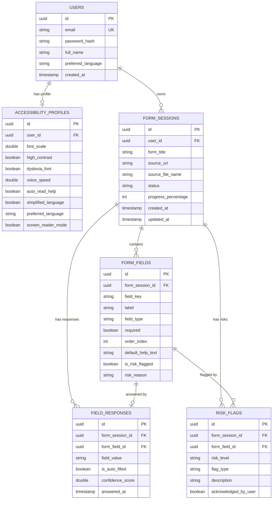

# Database Schema & Data Layer Documentation

This document describes the database schema, entity relationships, and persistence configuration implemented in the Spring Boot backend (`com.fillforme.backend`).

---

## 1. Database Architecture

* **Development Engine**: H2 In-Memory Relational Database (`jdbc:h2:mem:fillformedb`).
* **H2 Console**: Accessible locally at `/h2-console` (Username: `SA`, Password: empty).
* **Production Compatibility**: Standard ANSI SQL schema fully compatible with PostgreSQL.
* **Schema Management**: Managed automatically via Spring Data JPA and Hibernate ORM (`spring.jpa.hibernate.ddl-auto=update`).

---

## 2. Entity Relationship Diagram (ERD)

---

## 3. Entity Overview Table

| Entity Class | Table Name | Description | Key Relationships |
| :--- | :--- | :--- | :--- |
| `User` | `app_users` | Stores user credentials and authentication data. | 1:1 with `AccessibilityProfile`, 1:N with `FormSession` |
| `AccessibilityProfile` | `accessibility_profiles` | Persists user UI styling and accessibility preferences. | N:1 with `User` |
| `FormSession` | `form_sessions` | Tracks active form ingestion sessions and completion progress. | N:1 with `User`, 1:N with `FormField`, `FieldResponse`, `RiskFlag` |
| `FormField` | `form_fields` | Definitions of extracted fields in a form session. | N:1 with `FormSession`, 1:1 with `FieldResponse` |
| `FieldResponse` | `field_responses` | User or AI auto-filled responses to specific form fields. | N:1 with `FormSession`, N:1 with `FormField` |
| `RiskFlag` | `risk_flags` | Security analysis warnings associated with sensitive fields. | N:1 with `FormSession`, N:1 with `FormField` |

---

## 4. Schema Initialization

Hibernate auto-generates tables on startup based on JPA entity annotations (`@Entity`, `@Table`, `@Id`, `@ManyToOne`, `@OneToMany`). For production PostgreSQL migration scripts, SQL scripts can be placed in `src/main/resources/schema.sql`.
